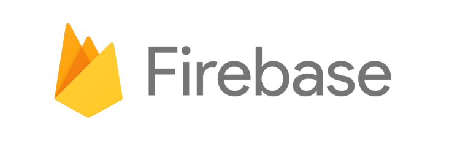

# Flutter Web Codelab (pt.4) - Firebase Integration: Cloud Firestore / Firebase Hosting

## Overview

Welcome to the exciting world of Flutter Web!

In this workshop, you've been building your own personal portfolio Flutter web app, with hard-coded data. In a real-life scenario, you might want to pull the data that feeds your portfolio web app from an external source (like a backend service, or a database) and that's where Firebase comes in!

### What is Firebase? 

[Firebase](https://firebase.google.com/) is an app development platform that helps you build and grow apps and games users love. It is backed by the Google Cloud and trusted by millions of businesses around the world, and it contains a suite of products for building robust mobile and web apps that can scale to billions of users.

In this session we'll be using [Firebase Cloud Firestore](https://firebase.google.com/products/firestore), a NoSQL document database that lets you easily store, sync, and query data for your mobile and web apps - at global scale. One of its best features is its serverless nature, in which you can stand up a Firebase backend without provisioning your own servers. You can access Cloud Firestore with traditional client libraries such as Node, Python, Go and Java, and in this codelab we'll access it via Dart through the [FlutterFire](https://firebase.flutter.dev/) library.

We will be working on the **Free-Tier** of Firebase (Spark - No cost $0/month) and you can see the full plan details and the decent quotas you get under this tier, which is enough to get started, by clicking on [this link](https://firebase.google.com/pricing?authuser=9&hl=en).

### Please don't forget to follow me on social media:

- On Twitter ([@drcoderz](https://www.twitter.com/drcoderz))
- On YouTube ([Roman Just Codes](https://www.youtube.com/channel/UCKsp3r1ERjCpKJtD2n5WtPg))
- On my [Personal Portfolio](https://romanjustcodes.web.app/)
- On [Medium](https://medium.com/@romanejaquez)
- On [LinkedIn](https://www.linkedin.com/in/roman-jaquez-8941a424/)

## Complete Code

The complete code is available on Github by following this [link](https://github.com/romanejaquez/roman-web-portfolio.git).

### Happy Coding!!!